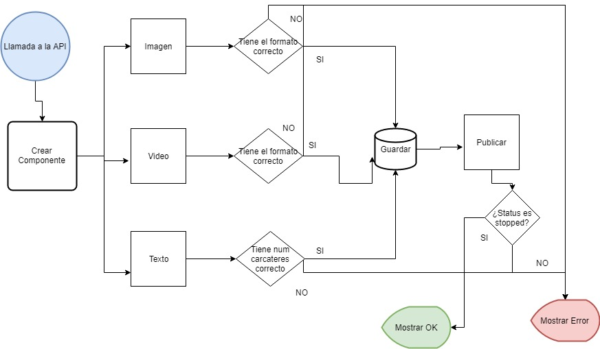

# ads_app
Este proyecto pretende demostrar mediante código limpio y el uso de symfony y composer, cómo gestionar 
una sencilla app de publicación de anuncios, para aprendizaje personal.
## Objetivo 
Creación de varios servicios que permitan crear y publicar un anuncio. 
* Un anuncio está compuesto por una colección de componentes. 
* Estos componentes, por el momento, queremos que sean del tipo imagen, vídeo o texto; pero en el futuro nos gustaría poder aumentar este listado.
* Cada tipo de componente tiene sus peculiaridades: un componente imagen consta de un enlace a una imagen externa, un formato y un peso; lo mismo pasa con el componente de tipo vídeo; por otro lado, un componente texto constará de una cadena de texto. 
* Además, todos ellos comparten unas características: un nombre, una posición en los 3 ejes (x, y, z), un ancho y un alto.


## Especificaciones:
* Hay 3 estados posibles en un anuncio: published, stopped, publishing.
* Un anuncio solo se puede publicar si su estado es stopped.
* Al crear un anuncio todos sus componentes deben ser válidos.
* Solo permitimos imágenes con el formato JPG y PNG.
* Un vídeo solo será válido si está en formato MP4 y WEBM.
* El texto no puede sobrepasar los 140 caracteres.
* Todo componente se debe serializar en formato JSON para poder comunicarnos con la
 aplicación de front.

### Flujograma explicativo 
 

## Configuración del proyecto
**Descargar dependencias de composer**

Descargar composer, y una vez instalado hacer:

```
composer install
```

O, según la versión de composer el comando podría ser:  `php composer.phar install`

**Configurar el fichero de entorno  .env**

Hay que tener un `.env` , si  no exist el fichero duplicar el `.env.dist` y cambiarle el nombre.
Posteriormente reajustar parámetros, especialmente en los referente a base de datos.  `DATABASE_URL`.

**Inicializar la Database**

Ejecutar los siguientes comandos. Los fixtures introducen data en la BD.

```
php bin/console doctrine:database:create
php bin/console doctrine:migrations:migrate
php bin/console doctrine:fixtures:load
